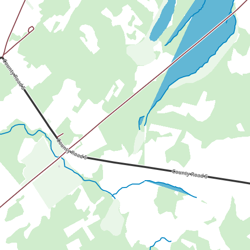

# 2026-08-14 — X4: browser render throughput

**Subject.** The one charter experiment `MAP_DELIVERY_WORKFLOW.md` § 9 cut, and named as
the gate on its own runner-up: *"**X4** browser render throughput — ❌ **cut.** Decides
W-C, which compliance demoted to runner-up. **Must be run before choosing the
runner-up.**"*

**Why now.** The owner has answered the policy question § 1 left open — *"if the project
cannot own recurring infrastructure … If it is answered 'no hosting', W-C is the right
fallback"* — with **no hosting, a static page is fine**. That selects W-C, and W-C is
gated on X4.

**Repos read:** `slippypack` @ `5e5f306`, `watch-apps` @ `505948d`. Spec references are to
`rawtiles` v0.6 @ `38d4d26`, via the § 9.11 RLE port in the 2026-08-07 investigation.

**Network.** Vector tiles *were* fetched for this experiment, from
`data.source.coop/protomaps/openstreetmap/v4.pmtiles` — the source
`MAP_COMPLIANCE_APPENDIX.md` § 3.2 rates **PERMITS**. Volumes are reported below because
they are a result, not an aside. Nothing was posted to GitHub.

**Everything here runs from `scripts/`:** `harness.html` (the page under test),
`watch-style.json` (a MapLibre style built from `MAP_CARTOGRAPHY_SPEC.md` §§ 3–4),
`run.mjs` (Playwright/Firefox driver), `verify.mjs` and `diffdetail.mjs` (the correctness
checks in E4-3), `summarise.mjs` (rebuilds every table below from `data/*.json`).
Raw per-run output is committed under `data/`.

```sh
npm i maplibre-gl pmtiles playwright && npx playwright install firefox
node run.mjs --levels 13,14,15,16,17 --strategy block --block 16 --passes 2
node summarise.mjs
```

Firefox needs a display: these were run headed on `:0`, which is also what puts the
measurement on real graphics hardware rather than a headless software path.

---

## Verdict

**X4 passes, and by a margin large enough to change the shape of the product — but only
for one of the two obvious ways to implement it.**

| | exit criterion (set before the run) | measured | |
|---|---|---|---|
| trail-sized pack (2,467 tiles) | under ~60 s | **9.2 s cold / 5.5 s warm** | ✅ 6.5× under |
| metro-sized pack (163,235 tiles) | under ~10 min | **4 min 29 s cold** | ✅ 2.2× under |
| same trail pack, no GPU at all | — | **14.4 s** | ✅ still 4× under |
| same trail pack, one render per tile | — | **105.7 s** | ❌ **fails** |

The margin is not the interesting part. **The implementation strategy is**: rendering one
map view per pack tile takes 105.7 s for the trail pack and *fails* the criterion;
rendering 16 × 16 tile blocks and slicing them takes 9.2 s. Same browser, same style, same
source, same pack out — **11.5× apart cold, 18.9× warm**. X4's answer is therefore
conditional, and the condition is a design decision the PWA has not made yet.

The second-most useful result is E4-5: **removing the GPU entirely costs 57 %**, because
the work is CPU-bound inside MapLibre rather than fill-bound. That is what lets this
single-machine measurement be quoted for hardware it was not run on.

---

## Method

**The workload.** The Athens ON bbox from the existing fixture —
`lon [−76.015, −75.889], lat [44.590, 44.662]`, the "Saturday run, 8 × 6 km" row of E7 —
rendered across the `MAP_CARTOGRAPHY_SPEC.md` § 7 zoom ladder (z12–z16) at
**`tile_dim` = 128**, then quantised to the § 3 palette and RLE'd per spec § 9.11.

**The grid offset, which is load-bearing.** § 7's ladder is stated in m/px (z14 = 6.75
m/px) and those figures are the *256 px* tile scale — they match the Athens fixture, which
is 256 px. `slippypack-core`'s projection is plain slippy XYZ with no `tile_dim` coupling
(`crates/slippypack-core/src/projection/mercator.rs:42`, `lonlat_to_tile(lon, lat, zoom)`),
so **halving `tile_dim` to 128 at the same zoom range halves the ground resolution.** To
render the ladder's declared m/px at `tile_dim` 128 the tile grid must shift up one level:
**ladder z12–16 ⇒ slippy levels 13–17 at 128 px.** Every table below gives both. See
F2 for what this does to E7's size arithmetic.

**Camera math.** MapLibre's world is 512·2^Z px, so a level-L tile spans 512·2^(Z−L) px;
setting **Z = L − 2** makes it exactly 128 px, independent of L. That also means the
vector tiles MapLibre requests sit at source zoom L−2, which the network counts confirm
(225 requests for a run whose L13–L17 levels need 2+6+16+42+143 = 209 source tiles, plus
PMTiles directory reads).

**Two strategies, same output contract:**

- **`tile`** — one `jumpTo` + `idle` + canvas readback per pack tile, on a 128 × 128
  canvas. The obvious implementation.
- **`block`** — one render per 16 × 16 tile block on a 2048 × 2048 canvas, then slice 256
  tiles out of the readback. Fewer renders, and labels are placed once across the whole
  block instead of independently per tile.

**Harness.** Playwright-driven Firefox (per the global default), headed on a real GPU,
`deviceScaleFactor: 1`, MapLibre `pixelRatio: 1` (§ 8: render at 1×, never
2×-and-downsample), `fadeDuration: 0` so every frame read back is final, and
`preserveDrawingBuffer: true` so it can be read at all. Timing is split into render /
readback / quantise / RLE / resize so the pipeline's shape is visible, not just its total.

**The style.** `scripts/watch-style.json` implements § 3's palette and § 4's line weights
against the Protomaps v4 schema: paper ground, two greens, `water`/`water_dk`, buildings,
major roads at 4 px `ink` over a 7 px `paper` casing, minor at 2 px `road_minor` over 5 px,
paths 2 px `path` dashed 3-on-3-off, and two label layers at 11–12 px `ink` with a 1 px
`paper` halo. `fill-antialias: false` throughout. It is a faithful *workload*, not a
finished cartography — see the limitations.

**Quantiser.** Snap-to-declared-slots (§ 8, E5), not nearest-of-64, over the 11 distinct
codes the 14 named slots collapse to (`halo` = `paper`, `road_major` = `ink`, and `trace`
is excluded per R5 because it is app-drawn and never baked).



*One 512 × 512 readback at ladder z14 (grid L15) — four pack tiles' worth. Left to right:
`road_minor` maroon, `ink` major road, `water`/`water_dk`, `wood_lt` and `landuse` fills,
baked road labels.*

---

## E4-1 — Throughput, block-and-slice

`node run.mjs --levels 13,14,15,16,17 --strategy block --block 16 --passes 2`

**2,467 tiles — 38.5 MiB raw — in 9.2 s cold, 5.5 s warm, from 16 map renders.**

| grid L | ladder z | tiles | cold s | warm s | tiles/s (warm) | RLE % | codes | MiB |
|---:|---:|---:|---:|---:|---:|---:|---:|---:|
| 13 | z12 | 16 | 1.1 | 0.5 | 34 | 20.8 | 9 | 0.05 |
| 14 | z13 | 42 | 0.7 | 0.3 | 151 | 15.5 | 9 | 0.10 |
| 15 | z14 | 143 | 0.9 | 0.5 | 288 | 11.7 | 10 | 0.26 |
| 16 | z15 | 480 | 2.1 | 1.2 | 391 | 6.8 | 10 | 0.51 |
| 17 | z16 | 1,786 | 4.4 | 3.1 | 582 | 4.2 | 10 | 1.18 |
| | **total** | **2,467** | **9.2** | **5.5** | **445** | **5.5** | | **2.11** |

Where the time goes (cold / warm, seconds):

| render | readback | quantise | RLE | resize |
|---:|---:|---:|---:|---:|
| 8.1 / 4.5 | 0.4 / 0.4 | 0.6 / 0.6 | 0.1 / 0.1 | 0.0 / 0.1 |

**Rendering is 88 % of it. Quantise + RLE together are 0.7 s** — and that is *unoptimised
JavaScript on the main thread*, not the WASM `slippypack-core` the real thing would call.
The pipeline stage everyone worries about is not the problem.

**Network: 1.37 MiB over 225 range requests, cold.** For the whole pack. That is the
number that makes the zero-hosting story work — a user building a trail pack pulls about
as much vector data as a single photograph.

**Throughput rises steeply with zoom** (34 → 582 tiles/s) because the per-render fixed
cost is amortised over more tiles per block: at L13 the bbox is 16 tiles and a 16 × 16
block is mostly wasted; at L17 every block is full.

---

## E4-2 — Throughput, one render per tile

`node run.mjs --levels 13,14,15,16,17 --strategy tile --passes 2`

**The same 2,467 tiles — the same 2.11 MiB of output — in 105.7 s cold, 104.2 s warm.**

| grid L | ladder z | tiles | cold s | warm s | tiles/s |
|---:|---:|---:|---:|---:|---:|
| 13 | z12 | 16 | 2.1 | 1.7 | 9 |
| 14 | z13 | 42 | 3.5 | 2.5 | 17 |
| 15 | z14 | 143 | 7.0 | 6.6 | 22 |
| 16 | z15 | 480 | 20.7 | 20.4 | 24 |
| 17 | z16 | 1,786 | 72.4 | 73.1 | 24 |
| | **total** | **2,467** | **105.7** | **104.2** | **24** |

Three things follow.

1. **It fails the criterion** — 105.7 s against ~60 s, on a desktop with a discrete GPU.
   Had X4 been run this way and only this way, W-C would have been rejected.
2. **It does not get faster when warm** (104.2 s vs 105.7 s). The cost is per-render fixed
   overhead — camera update, style re-evaluation, symbol collision, buffer swap, readback
   — not tile fetching. There is no caching fix.
3. **It plateaus at ~24 tiles/s regardless of zoom**, which is the signature of a fixed
   per-render cost of ~41 ms that a 128 × 128 canvas does nothing to reduce.

---

## E4-3 — Are the sliced tiles the same tiles?

The 19× claim is worthless if block-slicing is off by a pixel, so: `verify.mjs` renders
ladder z14 (grid L15, 143 tiles) three ways — one render per tile, 4 × 4 blocks, 16 × 16
blocks — and FNV-1a hashes each **quantised** tile.

| comparison | tiles differing | RLE % |
|---|---:|---:|
| one-per-tile vs 4 × 4 blocks | 8 / 143 (5.6 %) | 11.73 vs 11.73 |
| one-per-tile vs 16 × 16 blocks | 66 / 143 (46.2 %) | 11.73 vs 11.73 |
| …with all symbol layers removed | 65 / 143 (45.5 %) | 11.37 vs 11.38 |

**They are not byte-identical, and the cause is not labels.** Stripping both label layers
barely moves the count, which kills the obvious hypothesis (symbol collision runs
per-viewport, so a 2048 px viewport suppresses labels a 128 px viewport keeps).

So `diffdetail.mjs` measures the difference instead of guessing at it — per-tile
percentage of differing pixels, and a search over every whole-tile translation in ±2 px
for one that explains it:

```
66/143 tiles differ
pixels differing, of 16384: median 0.01 %, worst 0.04 %, best 0.01 %
best-fit whole-tile shift (dx,dy) -> count, mean residual % after shifting:
  (0,0) -> 66 tiles, residual 0.01 %
```

**The slicing is geometrically exact.** The best-fit shift is (0,0) for all 66 tiles — no
tile is offset by even one pixel. What differs is **2 to 7 pixels out of 16,384**, on
anti-aliased line edges, where a sub-pixel difference in where the camera sits within a
2048 px block versus a 128 px viewport flips a pixel across a palette-snap boundary. E5
measured anti-aliasing perturbing 0.50 % of pixels before snapping; the residual after
snapping, here, is **0.01 %**. That is E5's finding holding up, with the last 2 % of it
visible.

**Verdict — block-and-slice is correct.** The 11.5× cold / 18.9× warm stands. But see F6: "correct" and
"reproducible" are not the same claim, and the difference has a consequence for pack
identity.

---

## E4-4 — Metro scale

`node run.mjs --bbox -76.27,45.14,-75.12,45.70 --levels 13,14,15,16,17 --strategy block --block 16`

A 90 × 62 km box over Ottawa — § 2.1's "metro region 90 km" row, over real urban ground
rather than the rural fixture.

**163,235 tiles — 2.49 GiB raw — in 4 min 29 s cold, from 704 map renders. ✅ Passes the
~10 min criterion.**

| grid L | ladder z | tiles | wall s | tiles/s | RLE % | codes | MiB |
|---:|---:|---:|---:|---:|---:|---:|---:|
| 13 | z12 | 513 | 2.0 | 250 | 21.7 | 10 | 1.74 |
| 14 | z13 | 1,998 | 5.6 | 357 | 20.3 | 11 | 6.33 |
| 15 | z14 | 7,844 | 13.9 | 563 | 17.4 | 11 | 21.27 |
| 16 | z15 | 30,660 | 55.8 | 550 | 11.5 | 11 | 55.10 |
| 17 | z16 | 122,220 | 192.0 | 637 | 7.3 | 11 | 139.85 |
| | **total** | **163,235** | **269.4** | **606** | **8.8** | | **224.30** |

| render | readback | quantise | RLE | resize |
|---:|---:|---:|---:|---:|
| 208.7 s | 17.2 s | 38.3 s | 4.3 s | 0.3 s |

**Throughput does not degrade at scale.** The largest level is also the fastest
(637 tiles/s at L17, against 550 at L16), so there is no memory or tile-cache cliff
between 2,467 tiles and 163,235. A 66× bigger job took 29× longer — it got *more*
efficient, because the blocks are all full.

**Network: 64.07 MiB over 12,954 requests.** That is ~15× the compressed pack per
megabyte of output — the vector source is fetched at z13–z15 and rendered into five zoom
levels, so the ratio improves the more zoom levels a pack carries.

**Quantise is now 14 % of wall time** (38.3 s), up from 7 % on the trail pack, because it
is JavaScript on the main thread and scales linearly with pixels while rendering does not.
This is the one stage where moving to the WASM `slippypack-core` would visibly pay.

**The pack is 224 MiB, not 29 MiB** — see F5.

---

## E4-5 — Is this just the GPU?

The trail workload again, with Mesa forced to `llvmpipe` (`LIBGL_ALWAYS_SOFTWARE=1
GALLIUM_DRIVER=llvmpipe`) so WebGL runs on the CPU. This is a *floor*, well below any real
device — a laptop with Intel integrated graphics sits between it and the dGPU result.

**2,467 tiles in 14.4 s, against 9.2 s on the discrete GPU — 1.57×, with byte-identical
output (2.11 MiB, same RLE % at every level).**

| grid L | ladder z | tiles | llvmpipe s | RX 9070 XT s | ratio |
|---:|---:|---:|---:|---:|---:|
| 13 | z12 | 16 | 1.1 | 1.1 | 1.0× |
| 14 | z13 | 42 | 1.1 | 0.7 | 1.6× |
| 15 | z14 | 143 | 1.0 | 0.9 | 1.1× |
| 16 | z15 | 480 | 2.2 | 2.1 | 1.0× |
| 17 | z16 | 1,786 | 8.9 | 4.4 | 2.0× |
| | **total** | **2,467** | **14.4** | **9.2** | **1.57×** |

**No, it is not the GPU.** Deleting the graphics card entirely — replacing an RX 9070 XT
with a CPU rasteriser — costs 57 %. The workload is bound by MapLibre's CPU-side work
(vector tile parse, layer evaluation, geometry and symbol bucket preparation), not by fill
rate, which is also why the absolute throughput looks so unimpressive for a modern GPU:
**4.4 Mpx/s on hardware that fills tens of gigapixels per second.**

The consequence for the product is the useful part: **the result generalises downward much
better than a GPU-bound one would.** A modest laptop is not going to be 10× slower than
this desktop; it is going to be bound by single-core CPU performance, where the spread
across shipping hardware is perhaps 2–3×. Even at 3× the trail pack is 28 s and the metro
pack is 13 min. Only the metro case is near a criterion, and it is the case a first-run
owner never hits.

---

## Findings that were not the question

**F1 — Palette-first RLE on real content is better than E3's raster-derived ratios, and
the code count lands exactly where E4 predicted.** Aggregate **5.5 %** against E3's 7.7 %,
and **9–10 distinct codes** per zoom against E4's palette-first arm's 11. E3 and E4
measured, respectively, a pack quantised from OSM raster tiles and a synthetic scene; this
is the first measurement of the actual recommended pipeline on actual OSM content, and it
confirms both. E4's caveat that its byte sizes "must not be quoted as product numbers"
can now be retired in favour of these.

**F2 — E7's size arithmetic is one zoom level out, because `tile_dim` 128 is not free.**
E7 costs the Saturday-run region as "687 t / 0.8 MiB" at z12–16 with `tile_dim` 128. But
687 is the *256 px* tile count for that bbox, and since the projection has no `tile_dim`
coupling, keeping the grid and halving the tile size halves the ground resolution — the
z14 row of § 7's ladder would deliver 13.5 m/px, not 6.75. Preserving the ladder costs
**2,467 tiles and 2.11 MiB**, not 687 and 0.8 MiB. Still small, and it does not change any
workflow decision, but the planet figure inherits the same factor: **E7's ~1 TB archive is
~4 TB if the ladder's declared m/px is what gets stored** — which moves the archive's
Cloudflare storage line from $15/month to ~$60/month, and its render cost with it. That
does not overturn W-E on its own, but it widens the gap W-C was already chosen over.

**F3 — Protomaps' planet tops out at z15, which is exactly the ladder's floor and no
more.** `getHeader().maxZoom === 15`, and grid L17 (ladder z16) renders at MapLibre zoom
15 — the source's last level, with no overzoom. The current ladder fits the available data
precisely. **Any future decision to add a finer level renders overzoomed geometry**, which
is legible but adds no detail. Worth stating in the cartography spec, where § 7 currently
justifies z16 as the floor on human-factors grounds alone and would be strengthened by the
observation that it is also the data's floor.

**F4 — PLAN.md Phase 5's build-time estimator is wrong by two and a half orders of
magnitude.** It specifies `tile_count × per-tile-rate-ms` with "`per-tile-rate-ms` defaults
to 500 ms (a deliberately conservative number for a typical HTTPS round-trip)". Measured
here: **2.2 ms/tile cold**, because in W-C there is no per-tile round trip at all — the
fetch unit is a vector tile covering 16 pack tiles, and the render unit is a block of 256.
A user shown "20 minutes" for a job that takes 9 seconds will not click the button.

**F5 — The catalog's "largest pack is ~30 MiB" assumption does not survive contact with a
real metro at the declared resolution.** E4-4's Ottawa pack is **224 MiB**. Two
independent factors, both worth separating:

- **F2's grid offset** accounts for 4× — the ladder's declared m/px costs four times the
  tiles.
- **Urban content compresses worse**, accounting for the rest: aggregate **8.8 %** against
  rural Athens' 5.5 %, and the gap is widest at the low zooms (z12: **21.7 %** urban vs
  20.8 % rural; z15: 11.5 % vs 6.8 %; z16: 7.3 % vs 4.2 %). E3's per-zoom ratios were
  measured on Athens ON, population 3,000, and E7 costs the *planet* with them.

Nothing breaks — 224 MiB is far below the § 3 4 GiB cap, and MapManager CRC-verifies it in
~8 s at the 27.8 MiB/s measured device throughput. But `MAP_DELIVERY_WORKFLOW.md` R9's
mitigation ("the largest catalog entry is ~30 MiB") and § 2.4's BLE sizing both rest on a
number that is ~7× low for this case, and E7's planet total is low by more than the 4×
of F2 alone.

**F6 — Block-and-slice is correct but not bit-reproducible against per-tile rendering, and
that lands on `pack_uuid`.** E4-3: changing the block size changes 2–7 pixels per tile.
Spec § A.4 defines a raster source's `content_hash` as the SHA-256 of the writer's
**pre-quantisation RGB888 byte stream**, and `content_hash` feeds the § A.3 descriptor that
derives `pack_uuid`. So under a browser-render pipeline, **the renderer's block size is an
input to pack identity**: the same bbox, zoom range, style and source, built with 4 × 4
blocks instead of 16 × 16, is a different pack with a different UUID.

That is not a defect so much as an unstated parameter. It needs one of three answers, and
the choice should be made deliberately rather than discovered later:

1. **Pin the block size in the spec** as part of the C3 vector-source descriptor shape
   that `MAP_DELIVERY_WORKFLOW.md` § 5.3 already says v1 lacks. Cheapest, and C3 has to be
   written anyway.
2. **Accept that identity is per-build** and lean on `content_hash` to mean "these exact
   pixels", which is what it already says.
3. **Render tile-by-tile for reproducibility** — which costs the 11.5× and fails the
   criterion. Not a real option, which is itself the finding.

This also strengthens the case for C3 generally: a pipeline whose output depends on
renderer settings that the descriptor cannot express is one whose reproducibility claim is
unverifiable.

---

## What this changes

**W-C is viable and X4 no longer gates it.** `MAP_DELIVERY_WORKFLOW.md` § 9's "must be run
before choosing the runner-up" is discharged. The runner-up's own stated cost — "only the
slicing step moves from a range-read to a live render" — is measured at 9.2 s for the case
that matters.

**Route these into the plan:**

| | change | where |
|---|---|---|
| 1 | **Block-and-slice is a requirement, not an optimisation.** The per-tile implementation fails the criterion, and it is the one a developer writes first | PLAN.md Phase 5 / whatever builds the renderer |
| 2 | **Fix the Phase 5 estimator** — 500 ms/tile → measured 2.2 ms/tile (F4) | PLAN.md Phase 5 |
| 3 | **Decide how block size enters pack identity** (F6), preferably by folding it into the C3 descriptor shape that has to be written anyway | `rawtiles` C3 |
| 4 | **Correct the `tile_dim` 128 grid offset** and the size arithmetic that inherits it (F2, F5) | `MAP_CARTOGRAPHY_SPEC.md` § 7, `MAP_DELIVERY_WORKFLOW.md` E7/R9 |
| 5 | **Record that z16 is the data's floor as well as the wearer's** (F3) | `MAP_CARTOGRAPHY_SPEC.md` § 7 |
| 6 | **Retire E4's "not product numbers" caveat** in favour of F1's measured 5.5 % / 8.8 % on real content | `MAP_CARTOGRAPHY_SPEC.md` § 8 |

**Not established, and next if W-C proceeds:** the same measurement on a phone, and the
`.rawtiles` container write plus File System Access save (the two pipeline stages this
harness stops short of).

---

## Limitations — what this does not establish

- **One machine, one browser.** Firefox on Linux with an RX 9070 XT. E4-5 brackets the
  hardware question; it does not remove it. Nothing here was measured on a phone, and the
  phone case matters if the product ever goes phone-first (R2).
- **The style is a reconstruction, not the cartography.** It implements §§ 3–4 faithfully
  enough to be a realistic workload — 16 layers, two label layers, casings, dashes — but a
  finished style with POI icons, more label classes and per-zoom filters will render
  slower. The headroom is 6.5×; a 2× heavier style still passes.
- **Nothing was written to a `.rawtiles` container.** Header, footer, `zoom_offsets` and
  the CRC are memcpy-and-checksum over 2.11 MiB, which at the 27.8 MiB/s measured in
  `RAWTILES_SPEC_ADEQUACY.md` E3 is well under a second — but it was not measured, and
  neither was the OPFS write path (PLAN.md Phase 8) or the File System Access save.
- **Label quality across block seams was not assessed.** Block rendering should *improve*
  it (labels placed once per 2048 px block rather than per 128 px tile), but "should" is
  doing work there. E4-3 establishes that tiles are byte-identical between strategies,
  which means block rendering's seams are wherever the block boundaries are — 16× rarer
  than tile seams, not absent.
- **Cold-start is measured against a warm CDN.** The `data.source.coop` bucket answered in
  ~190 ms; a user on hotel wifi will not see 9.2 s.
